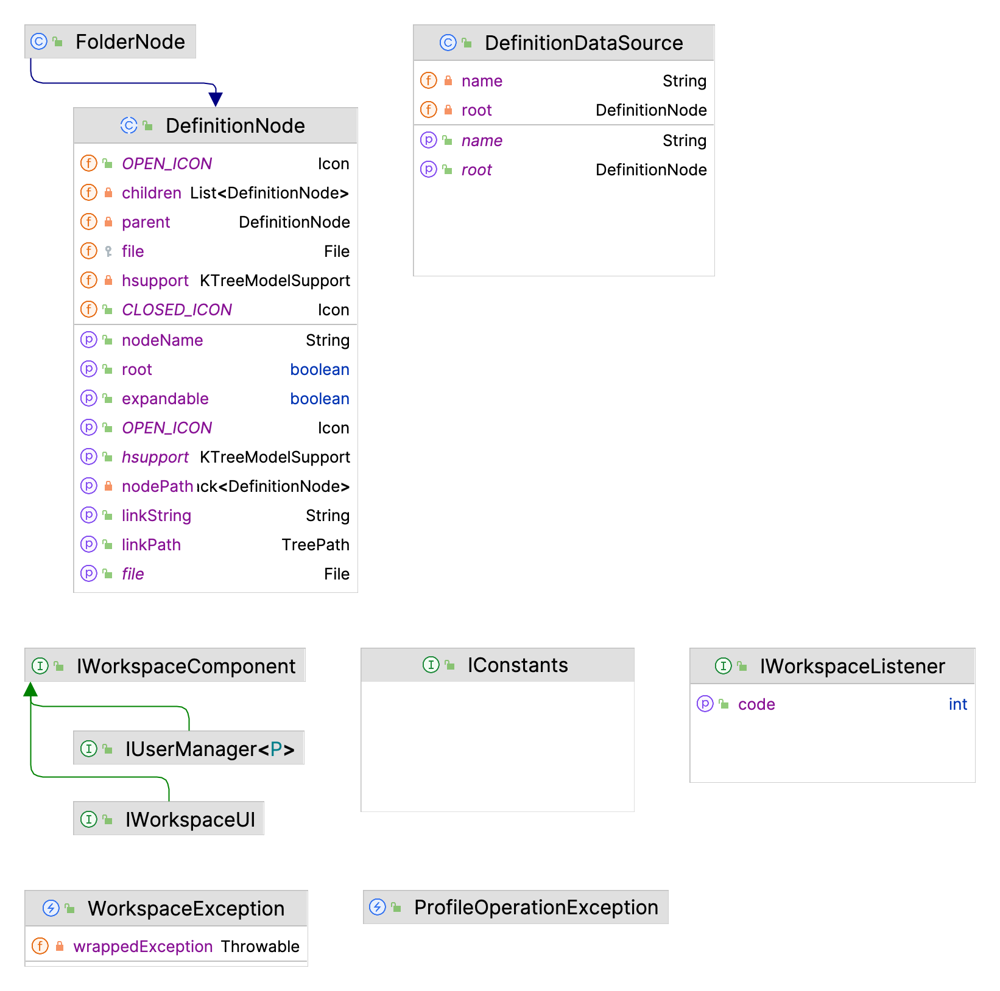
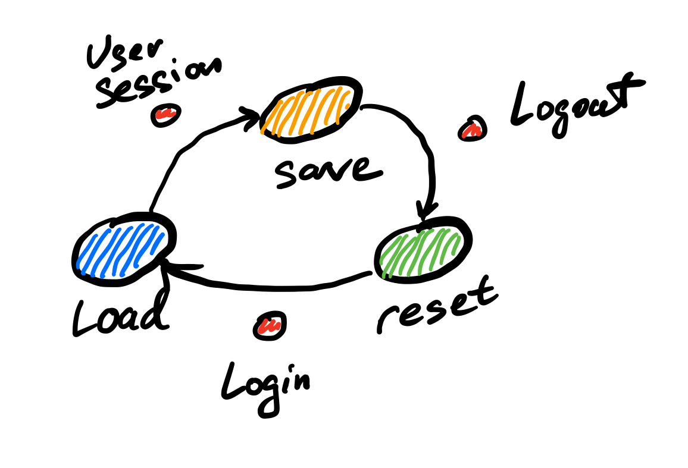
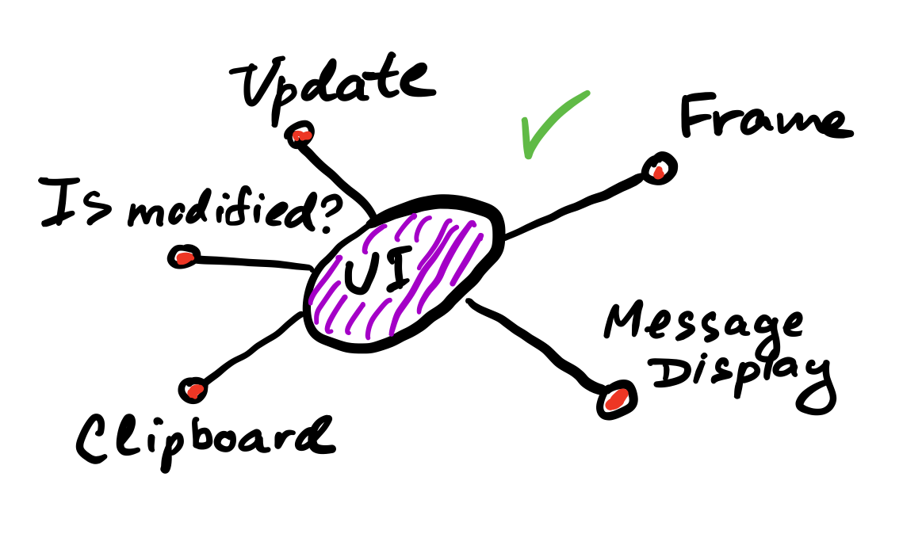

# Java Workspace API 

This package contains interfaces and classes which make API for the desktop. 



## Events Dispatcher and Workspace Listeners

The main goal to have an event mechanism with a special listener type is to loosely couple
otherwise not connected event producers and consumers. The dispatcher is just a collection of listeners
with one method to fire event and to give the reference to objects of the event:

```java
public void fireEvent(Integer event, Object lparam, Object rparam) {

    for (IWorkspaceListener listener : listeners) {
        if (event == listener.getCode()) {
            listener.processEvent(event, lparam, rparam);
        }
    }
}
```
For example:
```java
Object lparam  = new Object(); // some initialization
Object rparam = new Object(); // some initialization

EventsDispatcher eventsDispatcher = new EventsDispatcher();
// add listeners
eventsDispatcher.addListener(this);
// pass the references and ID
eventsDispatcher.fireEvent(NUMERIC_ID, lparam, rparam);  
```

This is a well-known Event-Driven Architecture pattern.


## Workspace Components

Each component, either a library or from a dynamically loaded plugin, which wants to follow
workspace life-cycle should implement the ```IWorkspaceComponent ``` interface.

It has only three methods to implement: to load and save data from any datasource,
and another method to reset the component to its initial state,
without profile specific information. 



## Workspace User Interface

Interaction with users is optional and workspace can be run in the background with a set
of plugins which are purely server-side. But if workspace is installed on a desktop, an implementation
of ```IWorkspaceGUI``` is needed. Such implementation can be loaded as a system plugin and 
it should be able to load/save/reset its state for different users since it is an instance of 
Workspace Component as well. However, there are a few more methods to implement:
1. A frame is needed to present to the users. Also, this frame has to be able to ask for login information to start user sessions.
2. User interface implementation has to provide means of showing errors and messages to users, since logging is not enough when running on a desktop.
3. User interface should be able to tell other components if user has modified something and haven't saved the work yet.
4. Clipboard is required for any UI components which use copy/paste or drag-n-drop operations.
5. The frame with its tree of components should be able to repaint itself on demand if other components have changed its state or look and feel.




## Definition Node

DefinitionNode class is the base class for different classes which deal with textual 
and binary information, stored on the local file system. Each node therefore
can read from disk and write its data back on disk.

Start with a root folder which will contain a tree structure of the files:
```java
File folder = new File("root").mkdirs();
```
Now let's create a folder node, named 'Nested Folder'. Thus, file structure is repeated 
in the virtual tree of definition nodes, built in memory:
```java
FolderNode root = new FolderNode(null, folder);
FolderNode folderNode = new FolderNode(root, new File("Nested Folder"));
...
```
The basic definition node doesn't do anything, it is abstract, but we can create 
an anonymous class for example and add it to parent node right in the constructor:
```java
DefinitionNode emptyNode = new DefinitionNode(folderNode, new File("Test file") {
    @Override
    public void load() {
        // implement storage
    }

    @Override
    public void save() {
       // implement storage
    }
}
emptyNode.save();                           
```
Please note that every new definition node created has to be explicitly saved in order to sync up 
with disk.

The node has a default leaf and folder state icons, can display locked state, can be moved
or deleted with the tree, and provides interface for Kiwi KTreeModelListener to listen to all these events:
```java
emptyNode.addHierarchicalAssociationListener(new MyModelListener());
```
Definition node datasource is an interface for Java UI components like trees and others, 
it main function is to initialize itself on the hierarchy of files first:
```java
DefinitionDataSource definitionDataSource = new DefinitionDataSource(folder);
```
or
```java
DefinitionDataSource definitionDataSource = new DefinitionDataSource(root.getRoot());
```
Then the data source gives opportunity to search for nodes using string path like this:
```java
definitionDataSource.findNode("/root/Nested Folder/Test file");
```
And a definition node can give its path back:
```java
String path = emptyNode.getLinkString();
```

## Workspace Exception

A special exception type to catch a general exception with a specific cause in it. It
may be useful to present additional exception details to users only if user wants the details
and requests them.

