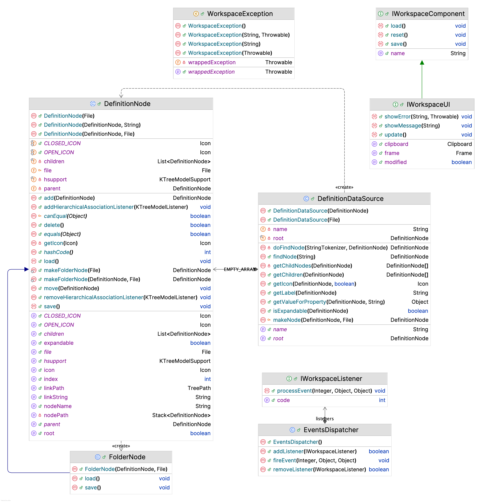

# jWorkspace API 

This package contains interfaces and classes which make API for the desktop. 
The accent is set on DefinitionNode class, its hierarchy and its data source.



## Quick Start: Definition Node

DefinitionNode class is the base class for different classes which deal with textual 
and binary information, stored on the local file system. Each node therefore
can read from disk and write its data back on disk.

Start with a root folder which will contain a tree structure of the files:
```
File folder = new File("root").mkdirs();
```
Now let's create a folder node, named 'Nested Folder'. Thus, file structure is repeated 
in the virtual tree of definition nodes, built in memory:
```
FolderNode root = new FolderNode(null, folder);
FolderNode folderNode = new FolderNode(root, new File("Nested Folder"));
...
```
The basic definition node doesn't do anything, it is abstract, but we can create 
an anonymous class for example and add it to parent node right in the constructor:
```
DefinitionNode emptyNode = new DefinitionNode(folderNode, new File("Test file") {
    @Override
    public void load() {
        // implement storage
    }

    @Override
    public void save() {
       // implement storage
    }
}
emptyNode.save();                           
```
Please note that every new definition node created has to be explicitly saved in order to sync up 
with disk.

The node has a default leaf and folder state icons, can display locked state, can be moved
or deleted with the tree, and provides interface for Kiwi KTreeModelListener to listen to all these events:

```
emptyNode.addHierarchicalAssociationListener(new MyModelListener());
```
Definition node datasource is an interface for Java UI components like trees and others, 
it main function is to initialize itself on the hierarchy of files first:
```
DefinitionDataSource definitionDataSource = new DefinitionDataSource(folder);
```
or
```
DefinitionDataSource definitionDataSource = new DefinitionDataSource(root.getRoot());
```
Then the data source gives opportunity to search for nodes using string path like this:
```
definitionDataSource.findNode("/root/Nested Folder/Test file");
```
And a definition node can give its path back:
```
String path = emptyNode.getLinkString();
```
