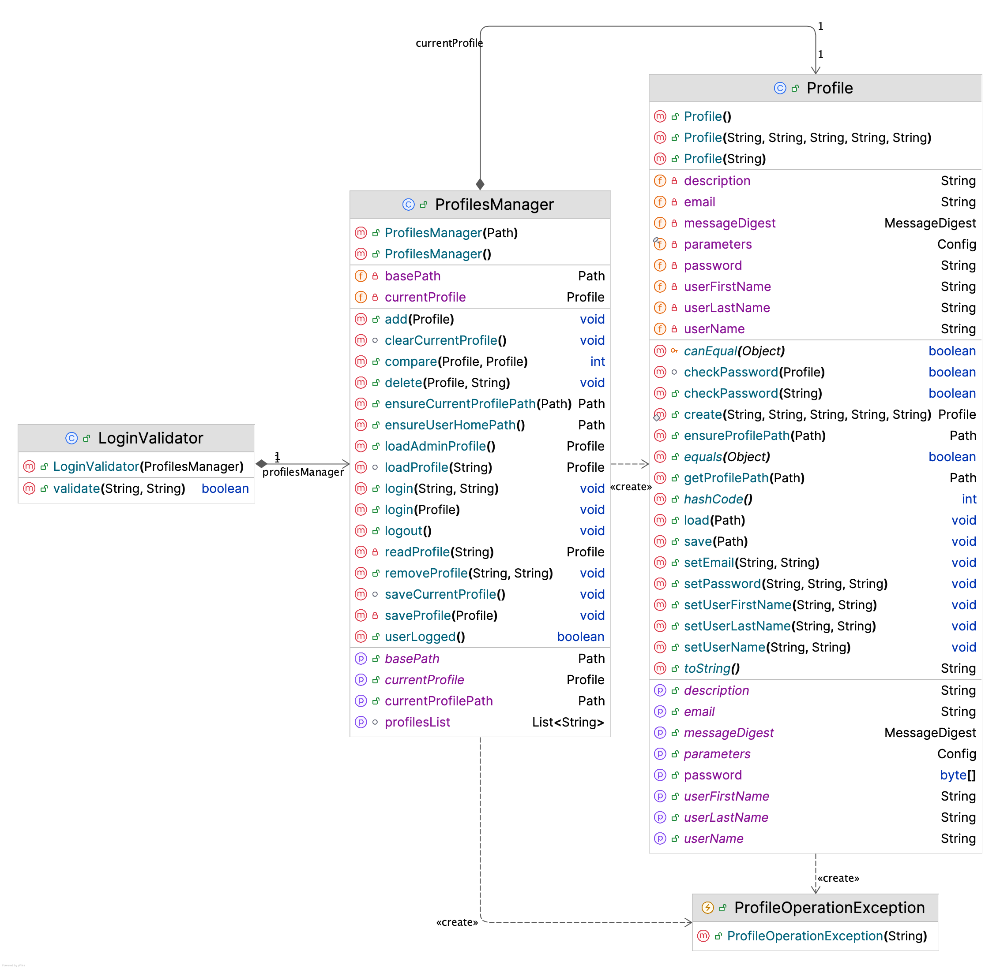

# Profiles API

Workspace main lifecycle use case is support for user sessions and user specific data
management. Every component is encouraged to save personalized information with the help
of Workspace Profiles API.



## Data Storage

Profiles are stored in the local file system, it can be either a user host OS home folder,
or current working directory or any other directory: 


This parameter has to be configured 
with an optional flag before start and should not be changed after it is configured since in that case
profiles will be reset. For example:

```bash
java -jar workspace.jar jworkspace.Workspace --path /some/user/specific/path
```

Setting directory back to the original one would restore the
profiles and the data. The default value is ```.jworkspace``` folder in the user home directory:


The folder has the name of the profile and it is a filesystem's responsibility
to ensure its uniqueness. Since workspace is usually run under current OS user
credentials, the folders are accessible to OS user, the profiles are not protected. 

Also there are three files created with a new profile:

1. **profile.dat** - user details and credentials
2. **pwd.dat** - encrypted password. So it is enough to remove this file to reset the password
3. **var.cfg** - storage for arbitrary string key-value pair which can be retrieved by different plugins and components

## Working with User Parameters

User Configuration is backed up with [com.hyperrealm.kiwi.util.Config](https://github.com/grauds/clematis.desktop/blob/30a804ec1b121352fd013a4b553e5bcbefe5238e/libs/kiwi/src/main/java/com/hyperrealm/kiwi/util/Config.java) class. 
This class extends <code>java.util.Properties</code> adding convenience methods for storing and retrieving properties
as strings, integers, booleans, colors, and fonts. If property is changed, ```java.beans.PropertyChangeEvent``` is fired.

For example:

```java
    ServiceLocator.getProfilesManager().getCurrentProfile().getParameters().setProperty("MAX_SIZE", "1Gb");
```

## Profile Operation Exception

A special exception type to catch a general exception with a specific cause in it. It
may be useful to present additional exception details to users only if user wants the details
and requests them.