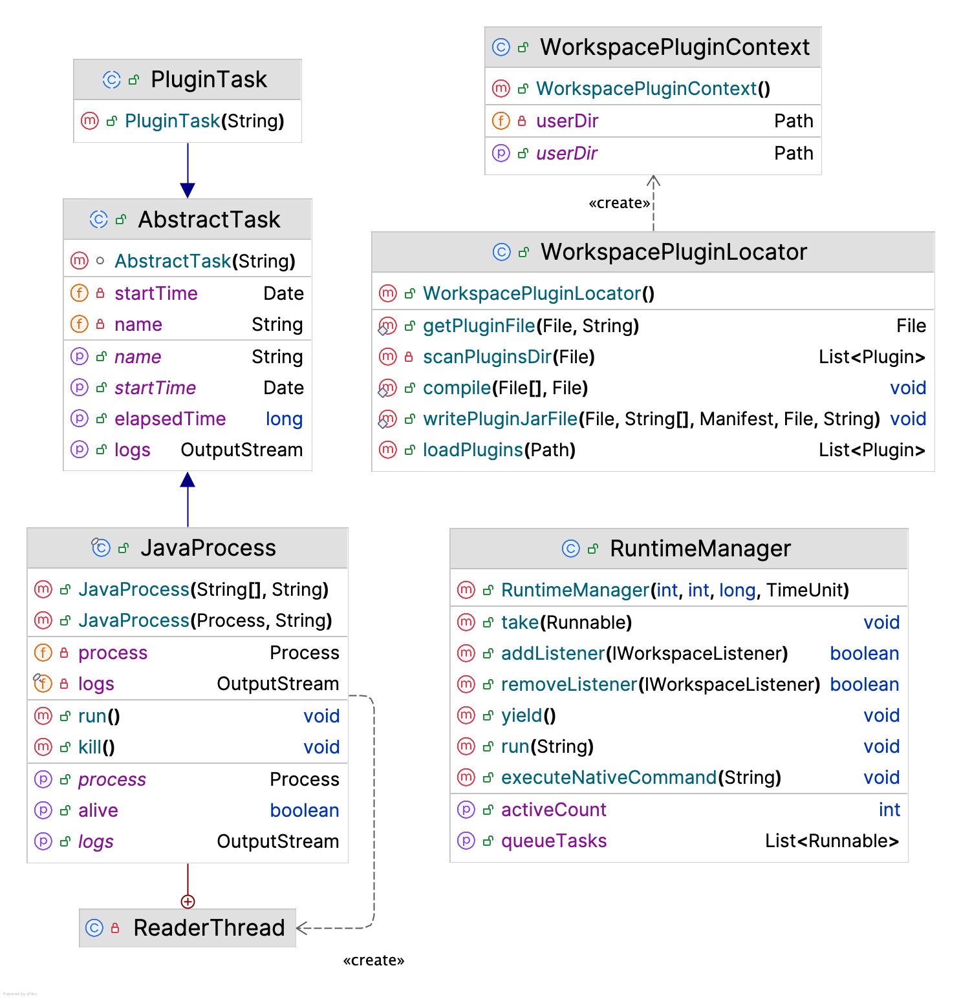
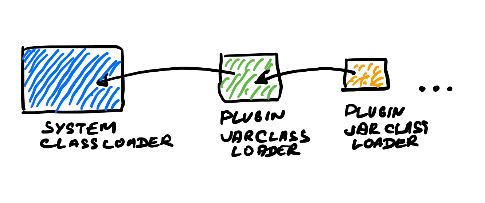

# Runtime Module

This module has two tasks: discover and load plugins and launch preconfigured external 
processes, either native or java ones. For the latter, it's required that a java program is 
configured beforehand in Installer module. Runtime module then would take a ready to use
command line with classpath, main class, parameters and arguments and would run it as a native command as well.

## Plugins

This module provides mechanism to load plugins from any directory and possibly
for any plugin which would like to have it's own plugins:

### Shared Context 

Also, each plugin gets an instance of <code>WorkspacePluginContext</code> which 
holds read only information for every plugin, like a currect user directory for a plugin
to be able to load and save its data from a proper folder during workspace lifecycle.

### 
