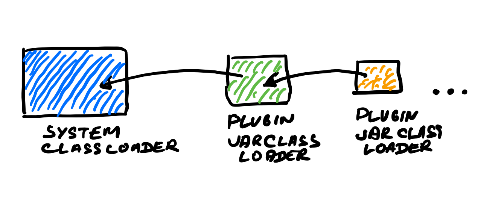

# Runtime Module

This module has two tasks: discover and load plugins and launch preconfigured external native, JShell or third-party Java processes. For the latter, it's required that the Java application is configured beforehand in installer module. Runtime module then would take a ready to use command line with classpath, main class, parameters and arguments and would run it as a native command.

## Plugins

This module provides mechanism to load plugins from any directory and possibly
for any plugin which would like to have its own plugins



### Loading Plugins

Workspace tries to find plugins in some predefined directories:
* **root_dir/plugins** - system-wide (shared across all user profiles) plugin
* **root_dir/shells** - system-wide UI additions to Workspace Desktop, also plugins, only using Desktop UI API
* **root_dir/users/[user_name]/plugins** - user plugins, they are bound to the user session and are destroyed on logging off.
* **root_dir/users/[user_name]/shells** - user UI additions to Workspace Desktop, the same session bound.

This is how all the plugins are loaded, (shells' loading is started by a different class but uses the same PluginLocator class):
```
[Phase 1: Discovery & Scans]
  WorkspacePluginLocator.loadPlugins(directory)
    │
    ▼
  WorkspacePluginLocator.scanPluginsDir() ──(Recursively scans & sorts alphabetically)
    │
    ▼ (Identifies folder/file ending in ".jar")
  PluginLocator.loadPlugin(jarFile)
    │
    ▼
[Phase 2: Metadata & Validation]
  Instantiate new Plugin(jarFile)
    │
    ▼
  Plugin.load() ──► Opens JAR ──► Reads META-INF/MANIFEST.MF
    │
    ├───► Reads metadata attributes (Name, Version, Build details)
    ├───► Extracts & sets Plugin Icon image binary
    └───► Enforces level security constraints (Throws exception if mismatched)
    │
    ▼ (If validation passes and instantiation is requested)
  PluginLocator.createClassLoader()
    │
    ▼
[Phase 3: Isolation Sandbox Setup]
  Instantiate PluginClassLoader
    │
    ├───► Inherits Forbidden Packages list  ("java.*", "javax.*" rules applied)
    ├───► Inherits Restricted Packages list (Local definitions blocked)
    └───► Resolves system or configured parent ClassLoader fallback
    │
    ▼
  PluginClassLoader.addJarFile(jarFile) ──(Registers active plugin zip asset map)
    │
    ▼
[Phase 4: Execution & Verification]
  PluginClassLoader.loadClass(className)
    │
    ├───► Checks JVM Memory Cache ──(If already loaded, skips lookups)
    ├───► Vets Package Rules ───────(Blocks forbidden/restricted paths)
    ├───► Delegates Upward ─────────(Queries system/parent ClassLoader)
    └───► Reads Raw Bytecode ───────(Streams byte array out of file, runs defineClass)
    │
    ▼
  Plugin field `pluginClass` successfully assigned
    │
    ▼
[End: Plugin context fully loaded & marked active]
```

It is possible to create a unified dependency map for plugins that need to declare dependencies on each other, but now it is not implemented for simplicity, the question is under consideration.

### Shared Context 

Each plugin gets an instance of <code>WorkspacePluginContext</code> which holds read-only information for every plugin, like a currect user directory for a plugin, in order to be able to load and save its data from a proper folder during workspace lifecycle.

### Events

If a plugin object is an instance of <code>Runnable</code> it is started in a separate thread
as soon as plugin is loaded and its main class is instantiated. 

There are two events are sent via <code>EventDispatcher</code>:

1. BEFORE_EXECUTE_EVENT - the parameters are two references, the first is to the <code>Thread</code> created to run the second argument <code>Runnable</code>
2. AFTER_EXECUTE_EVENT - the parameters are two references, the first is to the <code>Thread</code>, 
as in the first event, the second optional parameter would be a <code>Throwable</code> if the runnable not finished normally.

### Find Plugins Updates

Every plugin instance should have a not-empty `PluginHelpUrl` which typically is the address of the plugin GitHub repo. Each repo can contain multiple plugins, the updater will find the update by the file name. The updater will compare the versions, build dates and numbers (in this sequence) with the local instance, and will offer to update the local plugin if it is older. Development local builds are always considered to be newer than the remote ones.

```
[Start: findUpdates(List<Plugin>)]
  │
  ▼
Loop Through Each Plugin in List
  │
  ▼
Call checkUpdateAvailable(plugin)  ── (Runs the pipeline)
  │
  ├──> Success ───> Get true/false result
  │                   │
  │                   ▼
  │    Store result under "HasUpdate" key in plugin properties
  │
  └──> Exception ─> Catch Error ───> Log warning message ───> Skip
  │
  ▼
[End: All Plugins Evaluated]
```

## Logging

A concurrent, multi-client live logging and streaming subsystem is a cornerstone of this module. Its primary purpose is to capture raw text or process outputs generated by long-running background tasks, automatically timestamp each line, buffer the history, and safely broadcast (multiplex) these live log updates to multiple UI components or viewers simultaneously without causing memory leaks or race conditions.

```
[External Process / Task] 
         │ (Raw text/bytes)
         ▼
[LogReaderThread] ──► [AbstractTask] (Buffers & Timestamps via LiveLogOutputStream)
                            │
                            ▼
                    [TaskLogAdapter] (Manages shared state via static map)
                            │
                            ▼
                 [BroadcastLogListener] (Multiplexes to many destinations)
                      ╱     │     ╲
                 [UI View1] [File] [Socket]
```
* **Ingestion**: An active task or an external process prints standard output. LogReaderThread reads these bytes asynchronously.
* **Processing**: The bytes are sent to AbstractTask.log(). The internal LiveLogOutputStream bundles them into lines, calculates elapsed execution time, and appends the timestamp prefix.
* **Storage**: The fully formatted line is written to AbstractTask's internal memory buffer for future history retrieval. Will be upgraded to temp disk storage in future versions.
* **Distribution**: Simultaneously, the formatted line is passed to the task's active listener.
* **Fan-out**: TaskLogAdapter ensures this listener is a BroadcastLogListener, which instantly forwards the exact same timestamped line to every open UI panel tracking that specific task.

