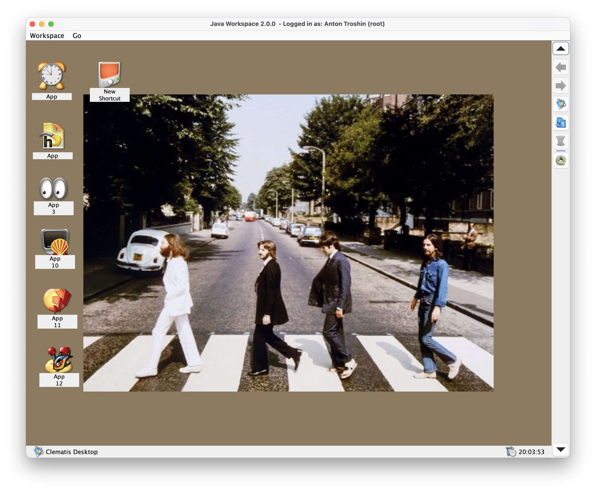
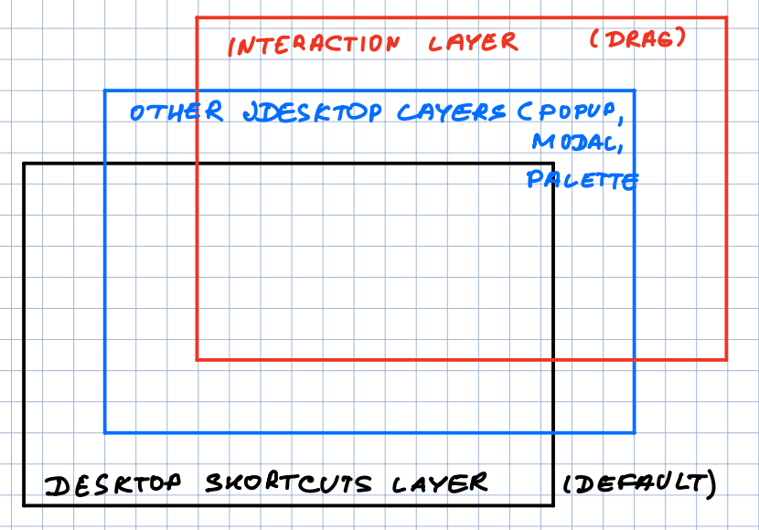

# Workspace Desktop UI

This package contains the default implementation of the user interface as it is described in the [API documentation](https://github.com/grauds/clematis.desktop/blob/master/libs/api/README.md#workspace-user-interface).

The desktop maintains a user session, saves and restores user data and provides another layer of plugin architecture; in other words, the desktop functionality is implemented as a set of plugins. 

## Three Layers of the Desktop Component

The desktop is composed of three layers:

* The top-most is the interaction layer that is responsible for handling user mouse moves and click actions. It also shows the selection rectangle for desktop shortcuts.
* The middle layers are the workspace layers that are responsible for rendering desktop internal frames and possibly other components like palettes, floating toolbars and so on.
* The bottom layer is where desktop shortcuts are stored and also the background image is rendered.

## Plugins for the Desktop

The desktop can give way to another user interface if the user switches to it using control buttons. Such user interface panels are loaded as plugins, so the functionality is extended. Also, plugins can be displayed on the desktop as floating internal windows. 

## Deployment

The distributive file with the desktop plugin has to be placed in the `.jworkspace/plugins` directory of the Clematis Java Workspace installation. This directory contains plugins shared with all users. 

