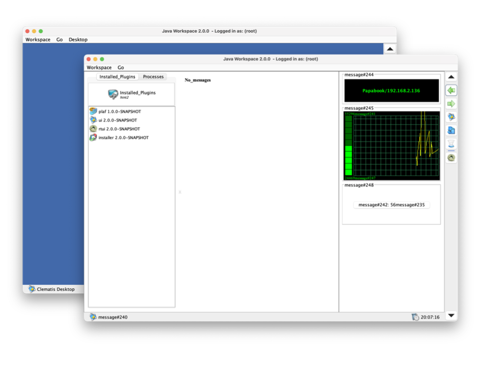

# Clematis Desktop for Java

## Introduction

Clematis Desktop is a pet project started back in '99 and being developed at spare time. 
It is built with Kiwi Library and Springboard - great hobby projects written by Mark Lindner, both gave
a significant contribution. 

## Modules

The architecture of the application is modular, its functionality is extendable via plugins.
The basis, however, is the following four modules:

1. **Workspace** - the entry point and a controller of a lifecycle [docs](./libs/api/README.md)
2. **Profiles** - to manage user data and configuration  [docs](./libs/profiles/README.md)
3. **Runtime** - plugins installer, launcher of third-party applications (with OS command line)  [docs](./libs/runtime/README.md) 
4. **Installer** - an installer of third-party java applications and libraries  [docs](./libs/installer/README.md)

   
## License

Clematis Desktop is licensed under GNU GENERAL PUBLIC LICENSE, v2.

Some plugins are licensed under the
[Apache License, version 2.0](http://www.apache.org/licenses/LICENSE-2.0). 

## Build

The following command builds the entire project

`./gradlew clean build`

