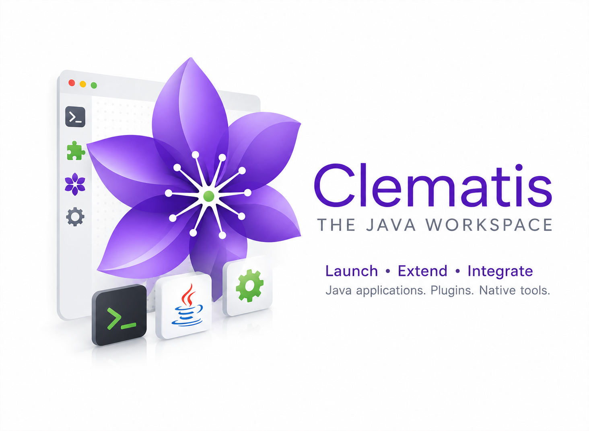
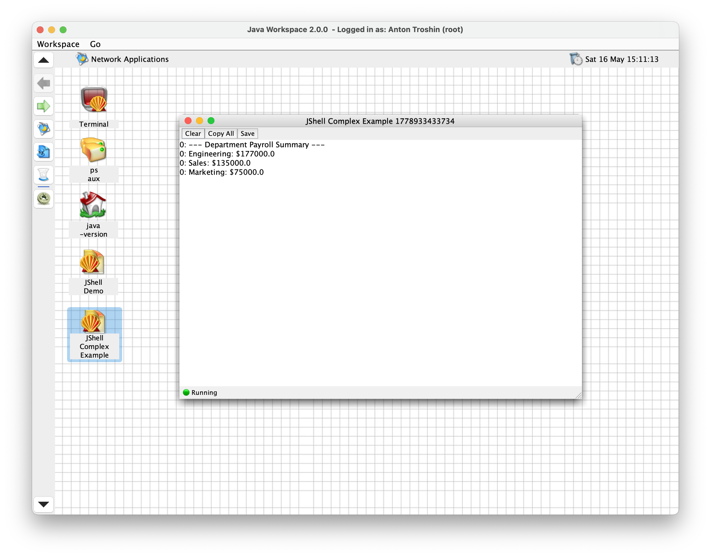

# Clematis Java Workspace

## Introduction

Clematis Java Workspace is a project for Master Degree at MIPT (Moscow Institute of Physics and Technology) started back in September'98. It has the long history, the first version of it was awarded as a Java Konkurs 2006 finalist.  

Now it is a pet project and a useful tool for my daily job.

## Modules

The architecture of the application is modular, its functionality is extendable via plugins.
The basis, however, is the following modules:

1. **Workspace** - the entry point and a controller of a lifecycle [docs](./libs/api/README.md)
2. **Profiles** - to manage user data and configuration  [docs](./libs/profiles/README.md)
3. **Runtime** - plugins installer, updater and launcher of third-party applications (with OS command line)  [docs](./libs/runtime/README.md)
4. Default inmplementation of UI is [Workspace Desktop](./modules/ui/README.md)

   
## License

Clematis Desktop is licensed under GNU GENERAL PUBLIC LICENSE, v2.

Some plugins are licensed under the
[Apache License, version 2.0](http://www.apache.org/licenses/LICENSE-2.0). 

## Build

The following command builds the entire project

`./gradlew clean build`

